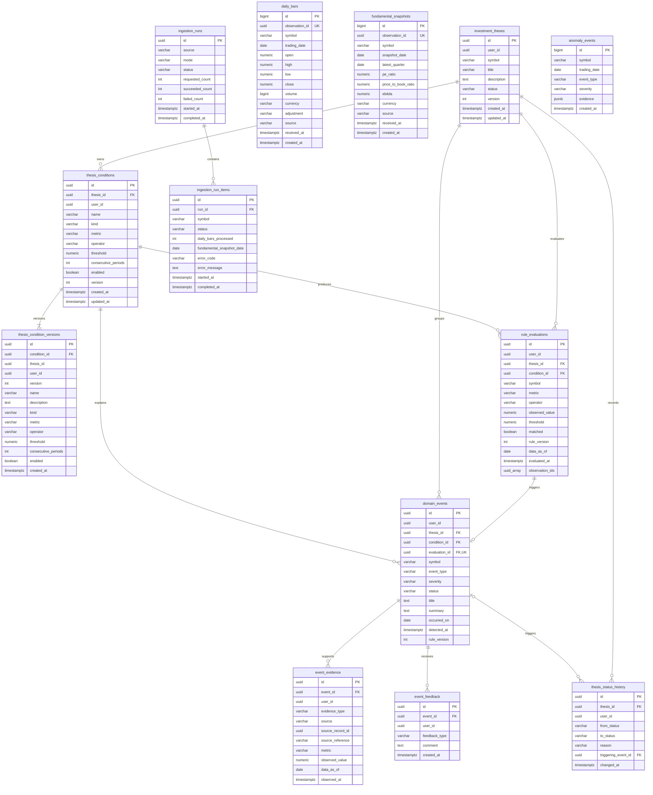

# 数据库 ER 图

以下 ER 图描述本轮后端闭环完成后的目标结构。`anomaly_events` 为旧版兼容表，不参与新业务关系。

## 图例与边界

- `PK`：主键；`FK`：外键；`UK`：唯一键。
- `investment_theses` 和 `thesis_conditions` 是当前状态投影。
- `thesis_status_history`、`thesis_condition_versions`、`event_feedback` 是追加式历史。
- `ingestion_runs` 与 `ingestion_run_items` 记录 cron/CLI 执行结果，不保存 API 密钥或完整异常堆栈。
- `rule_evaluations.observation_ids` 当前引用 `daily_bars` 或 `fundamental_snapshots` 的 `observation_id`；因来源跨表，本轮不建立数据库外键。
- `anomaly_events` 是旧版孤立表；新监控链路只写入 `domain_events`。
